<div align="center">

<picture>
  <source media="(prefers-color-scheme: dark)"  srcset="docs/screenshots/00-hero-rings.png">
  <source media="(prefers-color-scheme: light)" srcset="docs/screenshots/00-hero-rings.png">
  
</picture>

# SmartPatrol

### The sensor-free predictive-enforcement deployment brain for the Bengaluru Traffic Police

**Every night it reads BTP's own parking-violation data and prints tomorrow's 8 AM patrol plan** - ranked by real harm, forecast a week ahead, fair across stations, and honest when it isn't sure.

<p>
  <a href="https://smartpatrol-danish-3909s-projects.vercel.app/app"></a>
  <a href="https://youtu.be/ATXbWvJ3E9U"></a>
  <a href="https://drive.google.com/file/d/1sax6wWW9ilxucKK9mQok5GjUtAVmEsIS/view?usp=sharing"></a>
  <a href="https://github.com/agdanish/smartpatrol-gridlock"></a>
</p>

<p>
  
  
  
  
  
  
</p>

<sub>Flipkart × Bengaluru Traffic Police / ASTraM × MapMyIndia (Mappls) · Built on one official dataset · Powered by Mappls</sub>

</div>

> [!IMPORTANT]
> **We never showed it a map. It drew one.** Fed only *who* got ticketed and *when* - **zero** geographic input - SmartPatrol's offender graph self-organizes into **6 enforcement rings** that match Bengaluru's real geography (z = 4.8, **1.79× tighter than chance**). It scores **places, not people**, and abstains when it isn't sure.

---

## Contents

- [The problem](#the-problem)
- [The solution - Where, What-next, Who](#the-solution---where-what-next-who)
- [Architecture](#architecture)
- [The signature innovation - it drew its own map](#the-signature-innovation---it-drew-its-own-map)
- [Proof &amp; results](#proof--results)
- [Screenshots - the product, annotated](#screenshots--the-product-annotated)
- [How it works (nightly pipeline)](#how-it-works-nightly-pipeline)
- [Tech stack](#tech-stack)
- [Run it locally](#run-it-locally)
- [Reproducibility - 15/15](#reproducibility---1515)
- [Business model](#business-model)
- [Value to each partner](#value-to-each-partner)
- [How the 8 judging criteria are covered](#how-the-8-judging-criteria-are-covered)
- [Honest limitations](#honest-limitations)
- [Roadmap](#roadmap)
- [Team &amp; credits](#team--credits)
- [License](#license)

---

## The problem

Bengaluru's traffic enforcement is **reactive**. A finite force - roughly 4,792 personnel and 10 tow trucks - faces 154 declared parking hotspots across **54 stations**, and the binding constraint is not *whether* to deploy but ***where***. Today that decision is made from a ticket archive that nobody reads as a deployment plan.

Three structural blind spots make it worse:

- **Ticket *count* ≠ *harm*.** A footpath, a school gate, or a pedestrian crossing blocked is not the same as a quiet empty lane - but raw volume treats them identically.
- **Repeat offenders cross station lines invisibly.** A vehicle ticketed a little at four different stations looks minor to *each* desk, and no single station can run the join that reveals it.
- **The work is wildly concentrated, and that concentration is invisible at the front line.**

> [!NOTE]
> **142 corners carry 50% of all violations. 23 of 54 stations carry 80%.** The chaos is not spread out - it is a *where* problem hiding inside a 298,450-row spreadsheet the city already owns.

---

## The solution - Where, What-next, Who

SmartPatrol turns BTP's own nightly parking-violation export into **tomorrow's 8 AM patrol plan**. It answers three questions a head constable actually has, then ships the answer as paper.

<table>
<tr>
<td width="33%" valign="top">

### 📍 WHERE
**Rank corners by *real harm*, not ticket count.** A named, falsifiable harm index (PEHI) weights footpath / school / crossing / main-road over an empty lane (5 → 1), then a fair **max-covering roster** assigns beats per station so a handful of units cover most of the harm.

</td>
<td width="33%" valign="top">

### 🔮 WHAT-NEXT
**Forecast which quiet corners re-ignite next week** with an out-of-time survival model (GBM hazard, **AUC 0.80** vs a 0.71 naive baseline) - and **abstain when unsure** via a split-conformal reject option instead of guessing.

</td>
<td width="33%" valign="top">

### 👥 WHO
**Map the chronic + cross-jurisdiction offenders no single station can see.** **711 chronic** offenders, **139** of them spanning 2+ stations, recovered from an offender graph with an auditable trace to every station they touch.

</td>
</tr>
</table>

> **Output:** a printed **A4 8 AM duty sheet** an officer acts on cold · a read-only **React command center** (7 views) · per-beat **Mappls** turn-by-turn routing. Sensor-free · ~30-second nightly batch · **₹0 capex**.

---

## Architecture

One CSV in. A nightly Python batch of five engines. Frozen, diffable JSON artifacts. A static React console + a printed sheet out. **No server, no database, no live inference** - the only moving part runs once a night on a laptop, which is also why it cannot crash on stage.

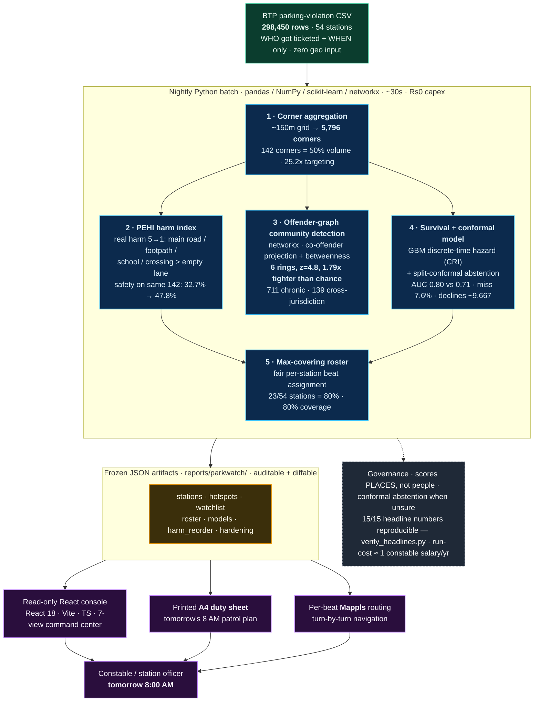
```mermaid
flowchart TB
    classDef src fill:#0b3d2e,stroke:#10b981,color:#ecfdf5,stroke-width:1.5px
    classDef eng fill:#0c2a4d,stroke:#38bdf8,color:#e0f2fe,stroke-width:1.5px
    classDef art fill:#3b2f0b,stroke:#f59e0b,color:#fffbeb,stroke-width:1.5px
    classDef out fill:#2a0e3d,stroke:#c084fc,color:#faf5ff,stroke-width:1.5px
    classDef gov fill:#1f2937,stroke:#9ca3af,color:#f9fafb,stroke-dasharray:4 3

    A["BTP parking-violation CSV<br/><b>298,450 rows</b> · 54 stations<br/>WHO got ticketed + WHEN only · zero geo input"]:::src

    subgraph BATCH["Nightly Python batch · pandas / NumPy / scikit-learn / networkx · ~30s · Rs0 capex"]
        direction TB
        E1["<b>1 · Corner aggregation</b><br/>~150m grid → <b>5,796 corners</b><br/>142 corners = 50% volume · 25.2x targeting"]:::eng
        E2["<b>2 · PEHI harm index</b><br/>real harm 5→1: main road / footpath /<br/>school / crossing &gt; empty lane<br/>safety on same 142: 32.7% → 47.8%"]:::eng
        E3["<b>3 · Offender-graph community detection</b><br/>networkx · co-offender projection + betweenness<br/><b>6 rings, z=4.8, 1.79x tighter than chance</b><br/>711 chronic · 139 cross-jurisdiction"]:::eng
        E4["<b>4 · Survival + conformal model</b><br/>GBM discrete-time hazard (CRI)<br/>+ split-conformal abstention<br/>AUC 0.80 vs 0.71 · miss 7.6% · declines ~9,667"]:::eng
        E5["<b>5 · Max-covering roster</b><br/>fair per-station beat assignment<br/>23/54 stations = 80% · 80% coverage"]:::eng
        E1 --> E2 --> E5
        E1 --> E3
        E1 --> E4 --> E5
    end

    A --> BATCH

    subgraph ART["Frozen JSON artifacts · reports/parkwatch/ · auditable + diffable"]
        direction LR
        J["stations · hotspots · watchlist<br/>roster · models · harm_reorder · hardening"]:::art
    end

    BATCH --> ART

    O1["Read-only React console<br/>React 18 · Vite · TS · 7-view command center"]:::out
    O2["Printed <b>A4 duty sheet</b><br/>tomorrow's 8 AM patrol plan"]:::out
    O3["Per-beat <b>Mappls</b> routing<br/>turn-by-turn navigation"]:::out
    C["Constable / station officer<br/><b>tomorrow 8:00 AM</b>"]:::out

    ART --> O1 & O2 & O3
    O1 --> C
    O2 --> C
    O3 --> C

    G["Governance · scores PLACES, not people · conformal abstention when unsure<br/>15/15 headline numbers reproducible — verify_headlines.py · run-cost ≈ 1 constable salary/yr"]:::gov
    BATCH -.-> G
```

---

## The signature innovation - it drew its own map

<div align="center">

</div>

We built an offender graph whose only edges are **(vehicle → station)** - *who* got ticketed *where*. **No latitude. No longitude. No map.** Then we ran community detection (`networkx` greedy-modularity + betweenness) on it.

The graph split into **6 enforcement rings** - and when we afterward looked up where those stations actually sit, the rings snapped onto Bengaluru's real geography:

- **Modularity 0.41** vs a degree-preserving null model's 0.262 → permutation **z = 4.8** (p ≈ 0).
- Same-ring stations sit **1.79× tighter** in real kilometres than chance would place them.
- **Betweenness** surfaces *bridge* stations - the cross-jurisdiction coordination hubs - and **super-hub vehicles** spanning up to 7 stations.

This matters for three reasons. It is **novel** (no documented prior art applies offender-graph community detection to parking-enforcement zoning). It is **honest** - it scores *places*, not people. And it is the proof that the structure SmartPatrol acts on is *real*, not drawn by hand: geography emerged from behaviour alone.

> [!WARNING]
> **It scores places, not people.** A second innovation rides alongside the rings: the forecast model is wrapped in a **split-conformal reject option** that **abstains on ~9,667 uncertain corner-weeks** rather than guess. SmartPatrol declines what it cannot call - the opposite of overconfident predictive policing.

---

## Proof &amp; results

Every number below is **labeled by how it is verified.** The 15 headline claims re-derive from the raw CSV in one command (`verify_headlines.py`); the model and ring figures come from the four `parkwatch_*.py` generators. Nothing here is hand-typed into the app.

| Claim | Number | What it means | Criterion |
|---|---:|---|---|
| Concentration | **142 corners = 50%** of all violations | A tiny target set - patrols stop spraying | Impact |
| Station concentration | **23 / 54 stations = 80%** | The load is structurally lopsided | Relevance |
| Targeting lift | **25.2×** vs random | Top-100 corners hold 43.5% vs 1.73% expected | Impact |
| Forecast quality | **AUC 0.80** (CI 0.79–0.80) vs **0.71** baseline | Beats the naive "what flared last week" rule | Robustness |
| Holds without recency | **0.77** recency-stripped | Not just memorizing last week | Robustness |
| Out-of-time stability | **73.9%** of top-142 persist across halves | The hotspots are real, not noise | Robustness |
| Knows its limits | abstains on **~9,667** corner-weeks | Conformal reject-option, not overconfidence | Innovation |
| Miss rate | **7.6%** (≤10% target) | Bounded error budget | Robustness |
| Pedestrian-safety coverage | **32.7% → 47.8% (+15.1pp)** | Same 142 corners, more footpaths/schools covered; holds OOT at 46.4% | Impact |
| Zero-geo rings | **6 rings**, z = 4.8, **1.79×** | Geography emerged from behaviour alone | Innovation |
| Chronic offenders | **711** chronic (≥10 violations) | A persistent, nameable population | Relevance |
| Cross-jurisdiction | **139** chronic offenders span ≥2 stations | A blind spot no station sees alone | Relevance |
| Cost | **₹0 capex**, run-cost ≈ 1 constable salary/yr | Deployable on owned data, no sensors | Viability |
| Reproducible | **15/15**, one command | Audit-grade trust | Clarity |

---

## Screenshots - the product, annotated

<a id="screenshots--the-product-annotated"></a>

> [!NOTE]
> 24 annotated frames from the live cinematic landing, the 7-view console (`/app`), and the printed duty sheet. Open the live app to click through them yourself → **[Live Command Center](https://smartpatrol-danish-3909s-projects.vercel.app/app)**.

### Act I - The landing (5-act scroll cinema)

<div align="center"></div>

**01 · "298,450 tickets. Every one a place and a time."** The opening act resolves an animated count-up over a live WebGL Bengaluru point-field, with the provenance line *"One official BTP export · sensor-free · Powered by Mappls."* It frames the whole product as built on one real dataset, not a mockup - the first thing a judge sees is honesty about scale and source. ***Proves: Clarity, Relevance.***

<div align="center">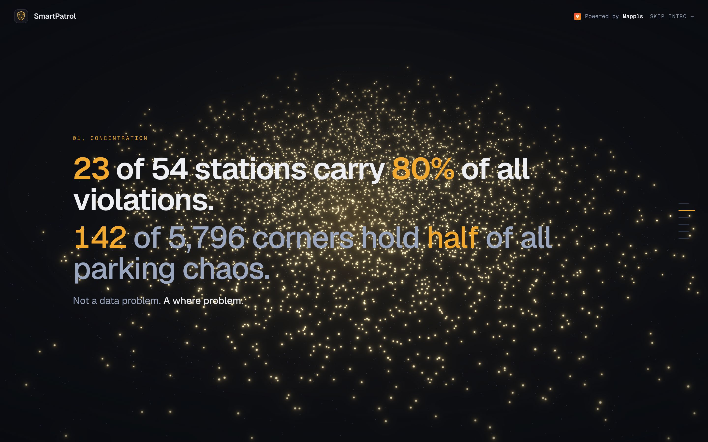</div>

**02 · "23 of 54 stations carry 80% of all violations."** Act 01 "Concentration" lands the core insight - *142 of 5,796 corners hold half of all parking chaos* - and closes on *"Not a data problem. A* where *problem."* This is what makes targeted deployment possible at all. ***Proves: Relevance, Innovation.***

<div align="center">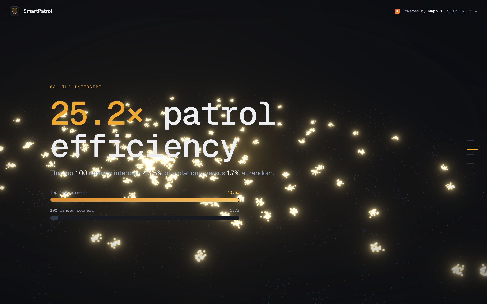</div>

**03 · "25.2× patrol efficiency."** Act 02 "The intercept" shows the two-bar comparison - top-100 corners intercept **43.5%** of violations versus **1.7%** at 100 random corners. One image, one number: how much more an officer-hour is worth when SmartPatrol guides it. ***Proves: Impact, Feasibility.***

<div align="center"></div>

**04 · "One vehicle. 22 violations. 4 stations. Invisible to all of them."** Act 03 "The hidden network" is the emotional climax - the animated constellation beside vehicle **FKN00GL16746** and the caption *"711 chronic offenders · 139 span 2+ stations."* A problem no single police desk can see today. ***Proves: Innovation, Impact.***

<div align="center">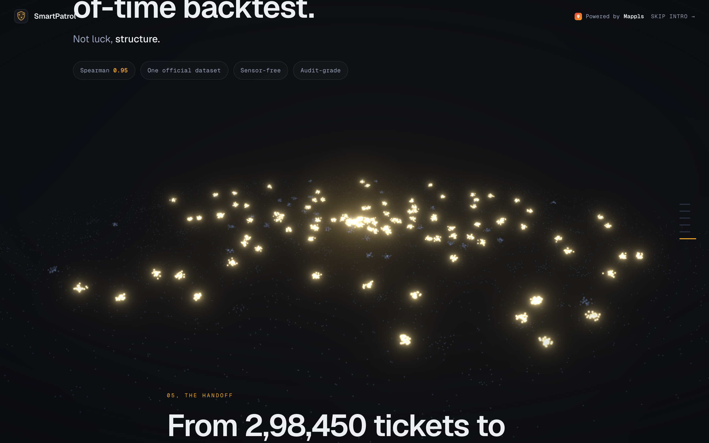</div>

**05 · "73.9% of hot corners stay hot in an out-of-time backtest."** Act 04 "Proof" pre-empts the *"is this just overfitting?"* question with the **73.9%** out-of-time stability headline and the credibility chips *"Spearman 0.95 · One official dataset · Sensor-free · Audit-grade."* ***Proves: Robustness.***

### Act II - The command center (7 views)

<div align="center"></div>

**06 · "The command center, oriented in one glance."** The `/app` header (*"Powered by Mappls"*), the provenance status strip (DATASET LOADED · COMPUTED 08:00 IST · INTEGRITY 298,450 rows · 168 dropped · BACKTEST 73.9% stable), and the 4-tile KPI band (**23/54**, **25.2×**, **711**, **73.9%**). Every headline number is on screen before any interaction, each bound to the verification report. ***Proves: Clarity, Robustness.***

<div align="center"></div>

**07 · "Tonight's hotspots → tomorrow's 8 AM patrol plan."** View 01 *Map & Roster*: the live Mappls dark basemap with harm-sized markers, the jurisdiction dropdown + patrol-units slider + "Generate 8 AM roster" button, and the roster panel showing the **% of violations covered**. This is the screen an inspector actually uses. ***Proves: Feasibility, Impact.***

<div align="center"></div>

**08 · "A real Mappls basemap, harm-weighted, with the beat route drawn."** Close-up with the *"Live basemap · Powered by Mappls"* chip and the *"⟶ 8 AM patrol · N beats · X.X km direct"* route chip, markers area-encoding harm over real corner coordinates. The partner integration is genuinely wired - and selection is solved on the actual roster, not a heuristic. ***Proves: Feasibility, partner value (MapMyIndia).***

<div align="center">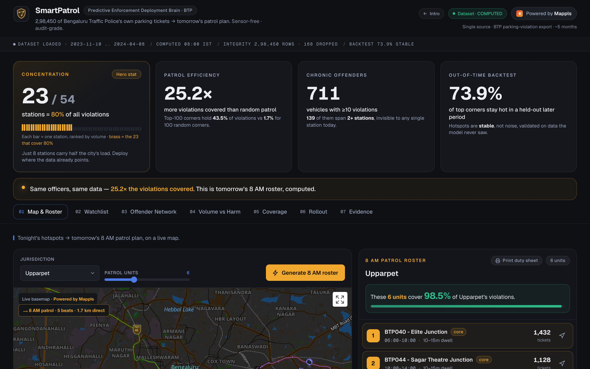</div>

**09 · "The 8 AM roster: ranked beats, dwell windows, one-tap navigation."** The roster panel: numbered route order, "core" must-hit beats, per-beat shift + dwell window, ticket counts, and a Mappls turn-by-turn arrow per beat - plus the governance line *"ranks locations and repeat vehicles, not individuals."* It connects analysis to a constable's literal walking order. ***Proves: Feasibility, Clarity.***

<div align="center">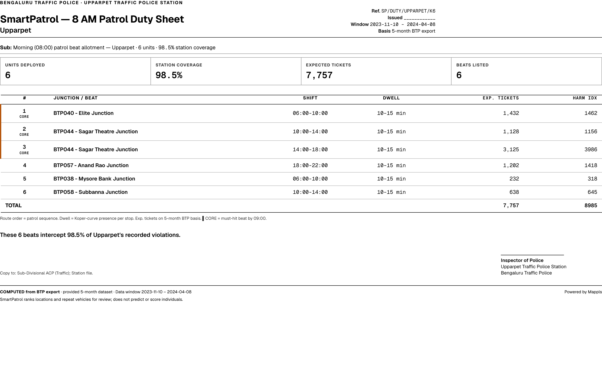</div>

**10 · "The printed A4 duty sheet - works with zero connectivity."** The print preview from the "Print duty sheet" button: black-on-white masthead *"SmartPatrol - 8 AM Patrol Duty Sheet"*, reference number, KPI band, the beat table with CORE tags and harm index, an Inspector signature block, and *"COMPUTED from BTP export."* The offline, crash-proof deliverable that slots into a real roll-call. ***Proves: Feasibility, Robustness.***

<div align="center">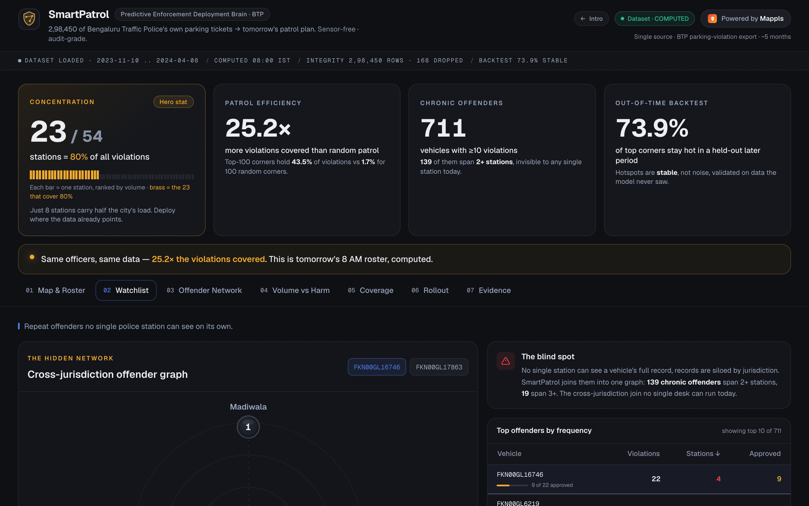</div>

**11 · "Each station sees only its own slice. Looks minor everywhere."** View 02 *Watchlist* before reveal: the cross-jurisdiction offender graph for **FKN00GL16746** in its idle "potential" state with the "Reveal the hidden network" button. It sets up the blind-spot narrative interactively - the judge triggers the payoff themselves. ***Proves: Innovation, Clarity.***

<div align="center">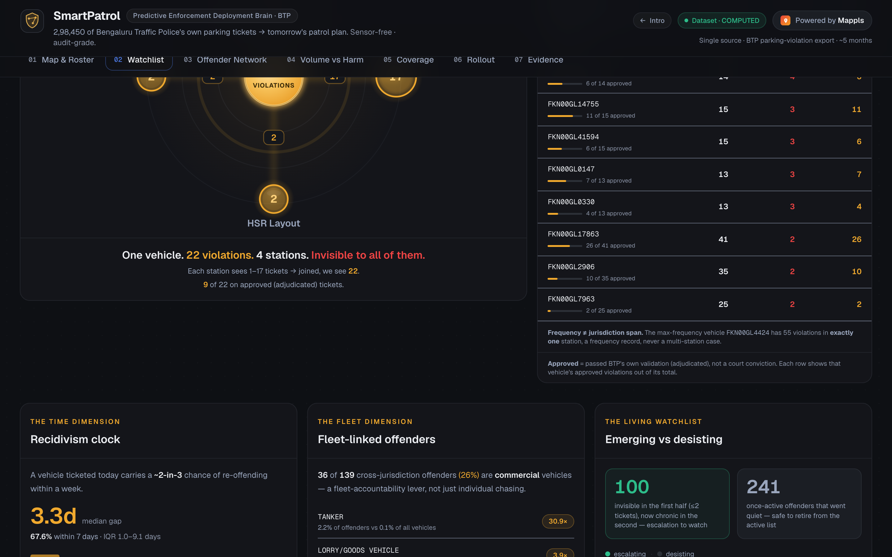</div>

**12 · "Joined: one vehicle, 22 violations, 4 stations."** The same graph after reveal - station silos ignite navy→brass, the aggregate hub counts up, the payoff reads *"Invisible to all of them,"* with the side stat *"139 chronic offenders span 2+ stations, 30 span 3+."* The signature cross-jurisdiction join no single desk can run today. ***Proves: Innovation, Impact.***

<div align="center">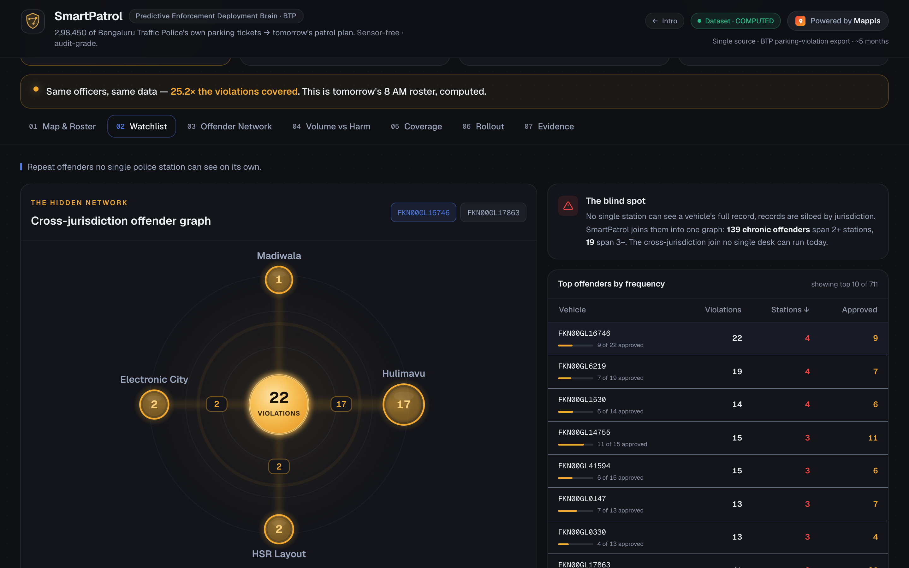</div>

**13 · "Frequency ≠ jurisdiction span - and a living watchlist."** The sortable "Top offenders by frequency" table (approved-vs-total bars), with the honest note that the **55-violation** record vehicle sits in *exactly one* station, plus the Recidivism Clock, fleet-linked offenders, and emerging-vs-desisting panels. Analytical depth with careful framing (*approved* = passed BTP validation, not a conviction). ***Proves: Robustness, Relevance.***

<div align="center"></div>

**14 · "We never showed it a map. It drew one."** View 03 *Offender Network*: the constellation of 54 stations self-organising into **6 enforcement rings**, captioned *"same-ring stations sit X km apart vs Y km by chance - 1.79× tighter, zero geographic input,"* with the *"Modularity 0.41"* badge. The intellectual centrepiece. ***Proves: Innovation.***

<div align="center">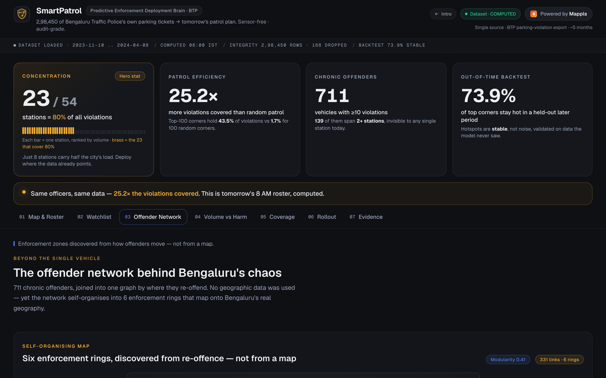</div>

**15 · "Bridge stations, strongest corridors, super-hub vehicles."** The three-up grid below the constellation: betweenness-ranked **bridge stations**, strongest shared-offender **corridors**, and **super-hub vehicles** - plus the method footnote (**z = 4.8, p < 0.01** vs a degree-preserving null). It proves the rings are statistically real, not a pretty layout. ***Proves: Robustness, Innovation.***

<div align="center">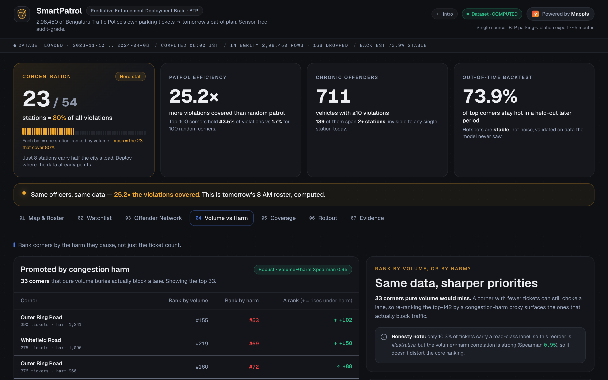</div>

**16 · "Rank by harm, not just ticket count."** View 04 *Volume vs Harm*: the promotion table showing corners that rise sharply under congestion-harm ranking (Δrank), with the *"Spearman 0.95"* robustness badge and the honest note that only **10.3%** of rows carry a road-class label. It optimizes for real-world danger while disclosing the proxy's limits. ***Proves: Impact, Robustness.***

<div align="center">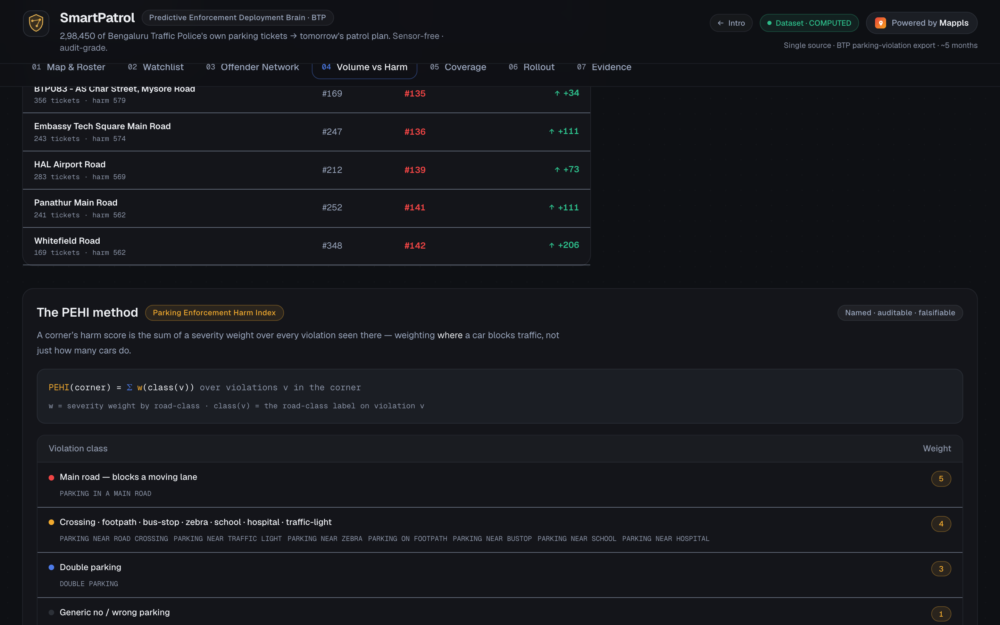</div>

**17 · "PEHI - a named, falsifiable harm index."** The PEHI method card: the equation, the severity-weight table (main road = 5 … generic parking = 1), the deepest-buried promoted corner, and the weight-sensitivity block (*"did you pick the weights?"* → a majority survive every reweighting). It turns an invisible code detail into an auditable, defensible method. ***Proves: Robustness, Innovation.***

<div align="center"></div>

**18 · "Which quiet corners flare up next week."** View 05 *Coverage* top: the Re-Ignition Forecast - the out-of-time survival/hazard model (**AUC 0.80** beating a **0.71** naive baseline), a next-week watch list with probabilities, feature importances, and the conformal buckets (commit-refire / commit-quiet / **abstain**) with the *"≤10% missed, measured 7.6%"* guarantee. The answer to *"where is your model?"* ***Proves: Innovation, Robustness.***

<div align="center">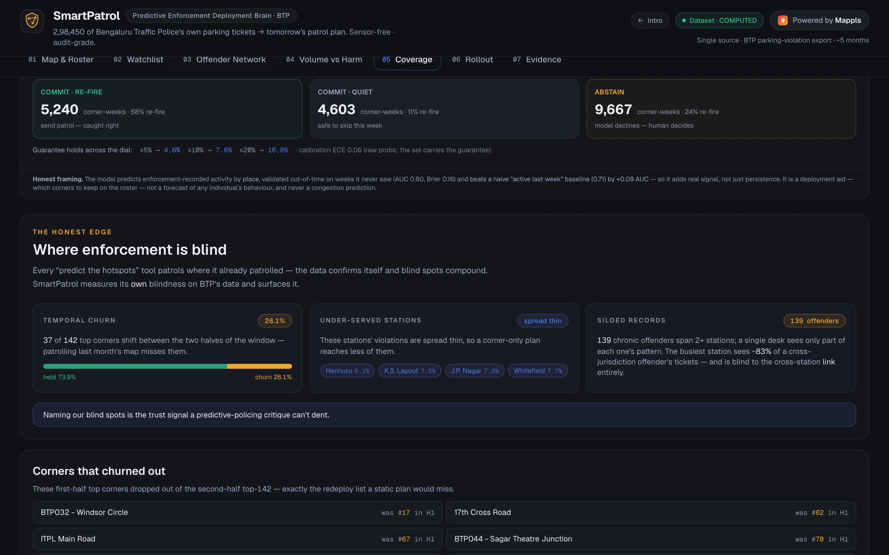</div>

**19 · "Where enforcement is blind - named, not hidden."** The Blind-Spot Radar: temporal churn %, under-served stations, siloed records, the "churned-out" redeploy list, and station momentum (e.g. V.V. Puram +120%), with the trust callout *"Naming our blind spots is the trust signal a predictive-policing critique can't dent."* The category-defining honesty move for a 2026 police jury. ***Proves: Robustness, Viability.***

<div align="center">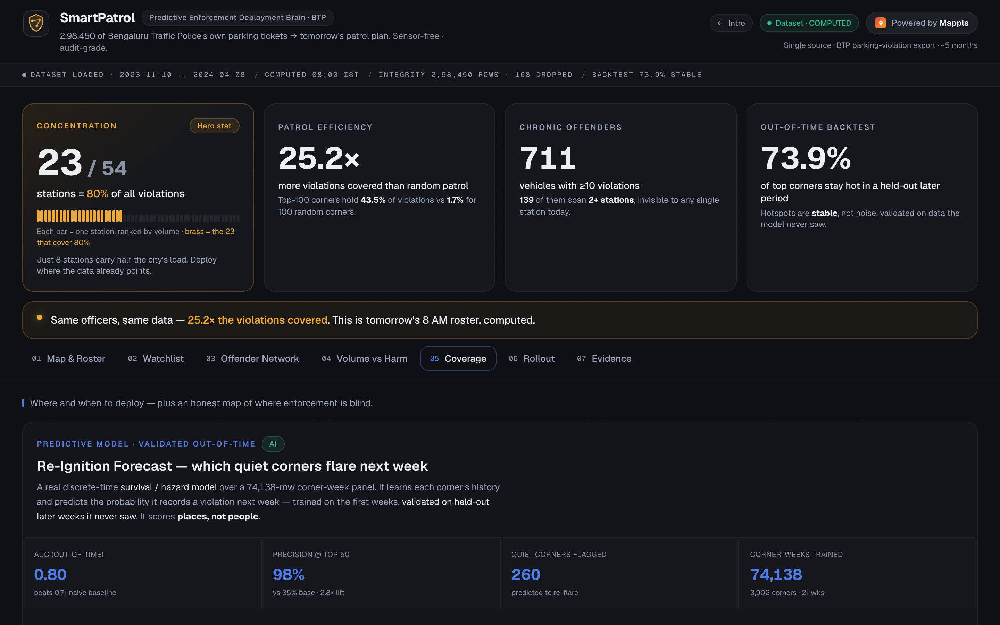</div>

**20 · "When to deploy - and who we leave behind."** The hourly coverage-gap chart (peak hour, median line, flagged multi-hour gap) above the Coverage Equity Ledger, ranking all 54 stations against an 80% fairness floor with never-cleared stations flagged red. Scheduling intelligence *and* fairness self-auditing on BTP's own data. ***Proves: Impact, Viability.***

<div align="center"></div>

**21 · "Dataset → nightly batch → printed 8 AM duty sheet."** View 06 *Rollout* top: the 5-stage deployment architecture (BTP export → parkwatch batch → frozen JSON → read-only console → printed sheet) with the chips *"Sensor-free · No live inference (crash-proof) · Runs on a laptop nightly."* It makes the *"ships Monday on data BTP already has"* claim concrete. ***Proves: Feasibility, Scalability.***

<div align="center">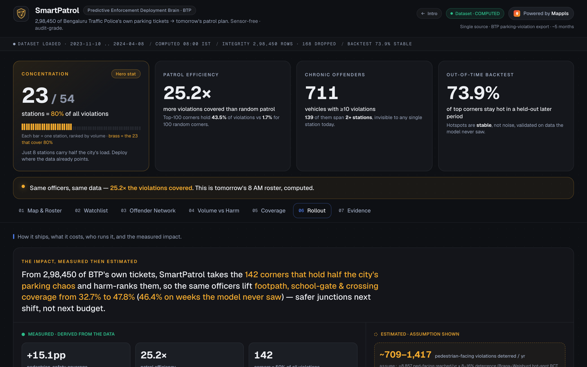</div>

**22 · "₹0 capex, 1 dependency, ~30s nightly - and a real risk register."** The Cost·Timeline·Dependencies strip (**₹0 capital**, **1 dependency**: BTP's CSV, **≈30s** compute), the scaling ladder (1 station → all 54 → any city via a 6-column contract), and the operational risk register (*"the default failure mode is yesterday's good plan - never no plan"*). The procurement-officer view, measured-vs-estimated clearly separated. ***Proves: Viability, Scalability, Feasibility.***

<div align="center">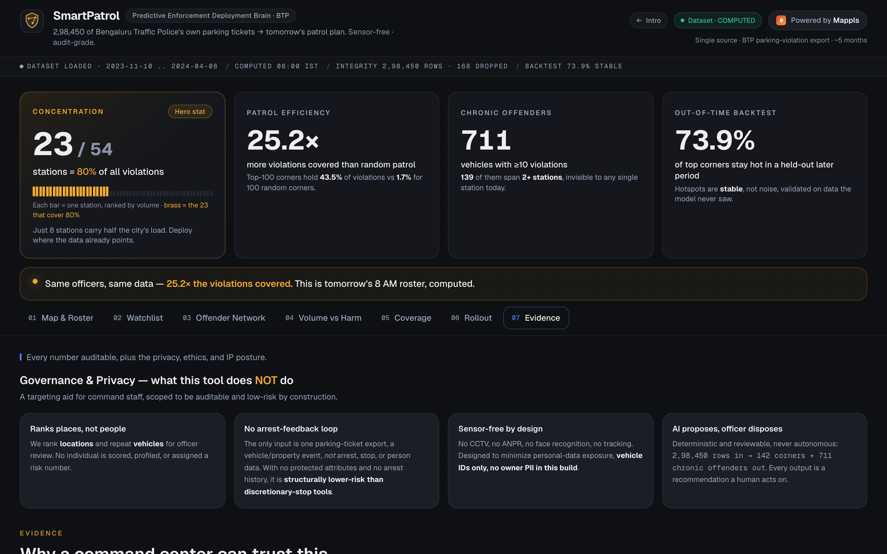</div>

**23 · "What this tool does NOT do."** View 07 *Evidence* top: the Governance & Privacy band (*ranks places not people · no arrest-feedback loop · sensor-free · AI proposes, officer disposes*) above the evidence cards. It answers the ethics question directly and shows DPDP-aligned restraint by design. ***Proves: Viability, Relevance.***

<div align="center">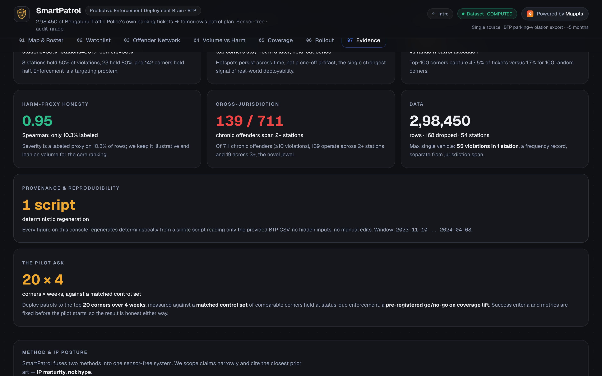</div>

**24 · "VERIFIED 15/15 - every number re-derives from the raw CSV."** The Method & IP card plus the Provenance ledger - each headline figure mapped to its exact computation and source columns - ending in the green *"VERIFIED 15/15 headline claims · `python src/verify_headlines.py`"* band. The audit-grade close: *built to survive an audit, not just a demo.* ***Proves: Robustness, Feasibility.***

<details>
<summary><b>How the 6 rings are computed (click)</b></summary>

`networkx` greedy-modularity community detection + betweenness over the offender→station projection (edges kept at weight ≥ 3). **No latitude or longitude is ever passed in.** Significance is a permutation **z = 4.8** against a degree-preserving (double-edge-swap) null model; rings come out **1.79× spatially tighter** than chance when their stations' real coordinates are looked up *afterward*. Source: `src/parkwatch_extend.py`.
</details>

---

## How it works (nightly pipeline)

The whole system is one ~30-second batch. Each file has one job and emits diffable artifacts; `verify_headlines.py` then re-derives every headline straight from the raw CSV and **fails loudly** on any drift.

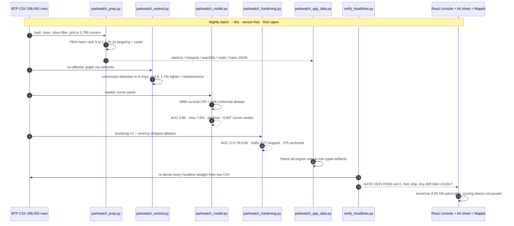
```mermaid
sequenceDiagram
    autonumber
    participant CSV as BTP CSV 298,450 rows
    participant Prep as parkwatch_prep.py
    participant Ext as parkwatch_extend.py
    participant Mod as parkwatch_model.py
    participant Hard as parkwatch_hardening.py
    participant App as parkwatch_app_data.py
    participant Verify as verify_headlines.py
    participant Out as React console + A4 sheet + Mappls

    Note over CSV,Out: Nightly batch · ~30s · sensor-free · Rs0 capex
    CSV->>Prep: load, clean, bbox-filter, grid to 5,796 corners
    Prep->>Prep: PEHI harm rank 5 to 1 + 25.2x targeting + roster
    Prep-->>App: stations / hotspots / watchlist / roster / harm JSON
    CSV->>Ext: co-offender graph via networkx
    Ext->>Ext: community detection to 6 rings, z=4.8, 1.79x tighter + betweenness
    CSV->>Mod: weekly corner panel
    Mod->>Mod: GBM survival CRI + split-conformal abstain
    Mod-->>Mod: AUC 0.80 · miss 7.6% · declines ~9,667 corner-weeks
    CSV->>Hard: bootstrap CI + recency-stripped ablation
    Hard-->>Hard: AUC CI 0.79-0.80 · holds 0.77 stripped · 375 anchored
    App->>App: freeze all engine outputs into typed artifacts
    Verify->>CSV: re-derive every headline straight from raw CSV
    Verify-->>Out: GATE 15/15 PASS exit 0, then ship. Any drift fails LOUDLY
    Out->>Out: tomorrow 8:00 AM patrol plan, scoring places not people
```

| File | Role | Key real outputs |
|---|---|---|
| `src/parkwatch_prep.py` | **Build + fact-verifier.** Cleans, grids to ~150 m corners, ranks by volume & harm, computes stations / offenders / cross-jurisdiction, temporal stability, and a **greedy maximal-covering roster** (per-station K=3..12 + citywide). | 7 JSON + GeoJSON + CSV in `reports/parkwatch/` |
| `src/parkwatch_extend.py` | **Innovation layer.** `networkx` offender→station projection → **6 greedy-modularity rings**, degree-preserving **null model → z-score**, betweenness bridges, geo-coherence test, recidivism cadence, fleet mix, momentum, blind-spot backtest, full 33-corner harm promotion + 3-variant weight sensitivity, pedestrian-safety coverage. | `derived.json`, `derivedData.ts` |
| `src/parkwatch_model.py` | **Two out-of-time models.** CRI = discrete-time survival / pooled-logistic hazard (LogReg + **GradientBoostingClassifier**) predicting P(corner re-fires next week), wrapped in **split-conformal abstention**. TQ = GBM on `validation_status`, train-only target encoding (no leakage). | `models.json`, `modelData.ts` |
| `src/parkwatch_hardening.py` | **Robustness.** 1000× bootstrap **95% CI** on OOT AUC; **recency-ablation** (strip every recency feature, still beat persistence); anchored-offender → main-road congestion link. | `hardening.json` |
| `src/parkwatch_app_data.py` | **Glue.** Reads the prep JSONs → emits the typed `appData.ts` the React app imports. | `appData.ts` |
| `src/verify_headlines.py` | **One-command audit.** Re-derives 15 headline claims from the raw CSV with tolerances; `sys.exit(1)` on any drift. | stdout, exit code |

> [!NOTE]
> **Generation order:** `parkwatch_prep.py` → `parkwatch_app_data.py` (depends on prep's JSON). `parkwatch_extend.py`, `parkwatch_model.py`, `parkwatch_hardening.py` each read the CSV independently, in any order. `verify_headlines.py` is fully standalone.

---

## Tech stack

**Brain (Python)**


**Console (web)**


**Maps &amp; deploy**

_Web_SDK_v3-E4002B?style=flat-square)


- **Models:** scikit-learn `GradientBoostingClassifier` + `LogisticRegression` for the survival hazard; a hand-rolled **split-conformal** reject option (3-way temporal split, class-conditional). Graph work via `networkx` (greedy-modularity communities, betweenness, double-edge-swap null model).
- **Landing:** the cinematic WebGL opener (`three` / `@react-three/fiber` / `drei` / `gsap` / `lenis`) is lazy-loaded on `/` only - **zero 3D cost on `/app`**.
- **Mappls** is loaded at runtime from the Mappls CDN (`apis.mappls.com/.../map_sdk?layer=vector&v=3.0`), keyed by `VITE_MAPPLS_KEY` - **not** an npm dependency. Without a key the app still runs and falls back to a schematic map.

---

## Run it locally

> [!IMPORTANT]
> Two parts: **(1)** the Python brain regenerates every artifact and number from the raw CSV; **(2)** the React console renders them. The CSV must sit at `datasets-given-in-web-portal/jan to may police violation_anonymized791b166.csv`.

**1 - The brain** (reproduce every number from the raw CSV)

```bash
.venv/bin/python src/parkwatch_prep.py        # clean + grid + harm + roster + core artifacts
.venv/bin/python src/parkwatch_extend.py      # offender graph + 6 rings + safety -> derivedData.ts
.venv/bin/python src/parkwatch_model.py       # CRI survival + conformal -> modelData.ts
.venv/bin/python src/parkwatch_hardening.py   # bootstrap CI + recency ablation -> hardening.json
.venv/bin/python src/parkwatch_app_data.py    # bundle prep JSONs -> appData.ts
.venv/bin/python src/verify_headlines.py      # AUDIT: 15/15 headline claims, exit 0 = all verified
```

**2 - The console** (`audit_v1/project`)

```bash
cd audit_v1/project
npm install
npm run dev      # http://localhost:5173   ( / landing · /app command center )
npm run build    # tsc + vite build -> dist/  (also copies index.html -> 404.html for SPA routing)
```

> [!NOTE]
> The console is **client-side only** - no server, auth, or database. For the live Mappls basemap, set `VITE_MAPPLS_KEY` in `audit_v1/project/.env` (a domain-whitelisted Mappls Web SDK key). Python deps: `pandas`, `numpy`, `scikit-learn`, `networkx`.

---

## Reproducibility - 15/15

`src/verify_headlines.py` re-derives every load-bearing claim **straight from the 298,450-row BTP CSV** and asserts it matches what the app ships - one command, fails loudly on any drift. This is the executable form of *"every number is auditable."*

```text
$ python src/verify_headlines.py
  [PASS] total rows: got 298,450, expect 298,450
  [PASS] corners for 50% of volume: got 142, expect 142
  [PASS] stations for 80%: got 23, expect 23
  [PASS] chronic offenders (>=10): got 711, expect 711
  [PASS] cross-jurisdiction chronic (>=2 stations): got 139, expect 139
  [PASS] top-142 out-of-time stability %: got 73.9, expect 73.9
  [PASS] harm-promoted corners: got 33, expect 33
  [PASS] Spearman(volume, harm): got 0.95, expect 0.95
  ...
  VERIFIED 15/15 headline claims from the raw CSV.  (exit 0)
```

> [!TIP]
> The 15 headline claims (concentration, offenders, backtest stability, harm) are audited here. The deeper model numbers - **AUC 0.80 (CI 0.79–0.80)**, conformal **7.6%** miss, the **6 rings** at **z = 4.8** - are regenerated by the four `parkwatch_*.py` engines and frozen into `reports/parkwatch/{models,hardening,derived}.json`. Screenshot **24** shows the same green badge inside the app's Evidence view.

---

## Business model

> [!NOTE]
> **The honest frame first.** The BTP dataset has **no fine-amount field**, so SmartPatrol makes **no rupee-ROI claim**. We refuse to invent revenue we cannot derive from the data. The value is measured in **safety and targeting per officer-hour**, not in collections - and every figure below traces back to the 298,450-row CSV by one command.

SmartPatrol is **owned infrastructure, not SaaS.** BTP runs the pipeline on hardware it already owns and **keeps the code and the IP outright** - no vendor lock-in, no recurring licence, no data leaving the building.

| | |
|---|---|
| **Model** | Owned-infra deployment (not SaaS). BTP owns the code, the artifacts, and the IP. |
| **Capital cost** | **₹0** - sensor-free. No cameras, no detectors, no new collection. |
| **Run cost** | **≈ one constable's salary / year** (≈ ₹3–8 lakh/yr) - a ~30-second nightly batch on owned hardware. |
| **Marginal cost to scale** | **₹0** - the same nightly batch already covers all 54 stations and 5,796 corners. |
| **Time-to-live** | **≈ 2 weeks**, gated only on a data-sharing MoU (the buyer's step, not an engineering blocker). |
| **Payback** | A non-question - there is no capex to pay back, and the run cost is below a single salary line. |

**Two delivery paths (not exclusive):** **(1)** direct license + integration to police departments and smart-city missions that already hold parking-violation data - the only thing a new city must provide is the 6-column data contract; **(2)** a strategic *enforcement-deployment intelligence* module inside a larger ITMS / Mappls-prime bid.

<details>
<summary><b>Why "no rupee ROI" is a strength, not a gap</b></summary>

A police tool that quotes a fabricated ROI is the first thing a serving commander distrusts. By refusing to attach rupees to a dataset with no fine field, SmartPatrol stays **auditable to the row** - the same property that lets every headline number reproduce from the raw CSV. The economic case stands without invented revenue:

- **25.2× targeting efficiency** - top-100 corners hold **43.5%** of violations vs **1.73%** expected for 100 random corners. Every redirected officer-hour does 25× the work.
- **+15.1 pp pedestrian-safety coverage** at **₹0 extra cost** - same 142 corners, same officers, re-ranked by harm (32.7% → 47.8%; holds out-of-time at 46.4%).
- **₹0 capex + sub-salary run cost** - there is nothing to amortise.

Value framed as *more safety per officer-hour*, never as ARR.
</details>

---

## Value to each partner

### 🚦 Bengaluru Traffic Police / ASTraM - *a command center on data you already own*

- **The 8 AM head-constable test, passed.** Output is a **printed A4 duty sheet** an officer acts on at shift start - six units, the exact corners, the watchlist - plus a read-only console and per-beat turn-by-turn. No analytics literacy required.
- **Deployment intelligence for manpower you're *already* committed to.** The constraint is *where to send* a finite force, not *whether to hire* - which is exactly what SmartPatrol answers.
- **Surfaces a blind spot the org chart structurally cannot see.** **139 of 711** chronic offenders spread tickets across 2+ stations and look minor to *each* desk; the cross-jurisdiction watchlist recovers them with an auditable trace.
- **Complements ASTraM - never duplicates it.** Built entirely on the Theme-1 violations file (no external join, no DQ risk), it adds the parking-enforcement-deployment + cross-jurisdiction-accountability + coverage-gap-timing layer, and is designed to *hand off* to ASTraM later.
- **Survives scrutiny.** Scores **places, not people**; abstains when unsure; reproduces 15/15 from the raw CSV.

### 🗺️ MapMyIndia / Mappls - *a flagship civic-AI showcase, used correctly*

- **A marquee public-safety reference deployment** - a live command center for the BTP with *"Powered by Mappls"* on every view.
- **Spec-compliant by design** - a single Mappls **Web Maps JS v3** vector basemap (no Leaflet/OSM/Google/Mapbox anywhere), no tile caching, reverse-geocoding done **offline at build time** into static GeoJSON. Mappls is presentation-only; BTP data is the sole source of truth.
- **Showcases India-aware addressing + routing** - per-beat turn-by-turn navigation and locality/pincode-resolved hotspot labels.

### 🛒 Flipkart - *applied, responsible AI for an Indian city*

- **A showcase of responsible AI giving back to the city** - scores places not individuals, declines low-confidence calls, states its caveats up front.
- **Impact + Innovation, the two axes the 1st-prize citation rewards** - a measured pedestrian-safety lift on the same officers, and a zero-geography offender-network discovery, both reproducible.
- **A safer, less-congested Bengaluru from data the city already has** - no new hardware, no new surveillance, ₹0 capex. The cleanest "smarter use of scarce public resources" story to put a Flipkart name behind.

---

## How the 8 judging criteria are covered

Each criterion maps to a **concrete, reproducible artifact in this repo** - not a claim. Every number regenerates from the raw CSV via `python src/verify_headlines.py` (15/15) and the `parkwatch_*.py` engines.

| # | Criterion | Concrete proof in SmartPatrol | Where to verify |
|---|-----------|-------------------------------|-----------------|
| 1 | **Feasibility** | Sensor-free · **₹0 capex** · ~30 s nightly batch on owned hardware · one input (a CSV export) · static export = crash-proof on stage · **deployed live today**. | [Live app](https://smartpatrol-danish-3909s-projects.vercel.app/app) · View 06 Rollout · `src/parkwatch_prep.py` |
| 2 | **Relevance** | Solves BTP's exact pain - finite force vs 154 hotspots + cross-station blindness - on **BTP's own 298,450 rows**; **8.0%** of violations are illegal main-road parking (the congestion mechanism, weighted 5/5). | `verification_report.json` · View 01 Map & Roster |
| 3 | **Innovation** | Offender graph **self-organizes into 6 enforcement rings from ZERO geographic input** (modularity 0.41 vs null 0.262, **z = 4.8**, **1.79×** tighter) + a **conformal abstention** layer that declines what it can't call. | View 03 Offender Network · `src/parkwatch_model.py` · screenshots 14–15 |
| 4 | **Impact** | Same 142 corners, same officers, **₹0 extra** → pedestrian-safety coverage **32.7% → 47.8% (+15.1 pp)**, holds OOT at **46.4%**. **25.2×** targeting efficiency over random patrol. | View 06 Rollout · `harm_reorder.json` · screenshots 03, 20 |
| 5 | **Robustness** | Out-of-time **AUC 0.80** (CI 0.79–0.80) vs 0.71; **holds 0.77 recency-stripped** (not "just recency"); conformal miss **7.6%** under a ≤10% budget; **73.9%** OOT plan stability. Scores **places, not people**. | View 05 Coverage · `hardening.json` · screenshots 18–19 |
| 6 | **Clarity** | A **printed A4 8 AM duty sheet** an officer acts on cold + a 7-view read-only console with a visible MEASURED-vs-ESTIMATED seam and caveats stated up front. | View 07 Evidence · [Demo video](https://youtu.be/ATXbWvJ3E9U) |
| 7 | **Scalability** | A **6-column data contract** means any city with parking data maps in; the same batch already covers all 54 stations / 5,796 corners at **₹0 marginal cost**; generalizes across time (73.9% OOT) and place (6 rings from zero geo). | `src/parkwatch_app_data.py` · View 01 station selector |
| 8 | **Viability** | **Owned infra, not SaaS** - BTP keeps the IP, no lock-in; run cost **≈ 1 constable's salary/yr**; **~2-week** time-to-live gated only on a data MoU; a falsifiable 20-corner × 4-week pilot is the ask. | [Business model](#business-model) · View 06 roadmap |

> [!IMPORTANT]
> **Every claim is reproducible or labeled.** Where the data cannot support a measurement - most importantly the road-class harm signal, present on only **10.3%** of rows - SmartPatrol labels it an **illustrative labeled proxy**, never a measurement. These caveats stay visible in the app and the deck - they are the integrity that lets a police buyer trust the rest.

---

## Honest limitations

> [!CAUTION]
> Kept visible on purpose - for a police jury, these *are* the credibility.

- **No fine-amount field** in the data → **no rupee-ROI claim**; value is safety + officer-hour targeting.
- **Severity / harm is a labeled proxy** - present on only **~10.3%** of rows - shown as illustrative, never as a measurement.
- **Timing reflects enforcement *presence*, not a congestion forecast.** The "nightly 08:00 IST batch" is the Python pipeline, not a live server feed.
- **The model is recency-dominated.** It beats the persistence baseline by a real but modest **+0.086 AUC**; recency-stripped it still leads at 0.77, but recency is its strongest signal.
- **Rings are descriptive, not causal**, and the 80% coverage-equity floor is illustrative, not a BTP-set target.
- **One city, one dataset, one window (Jan–May).** Offender IDs are anonymized vehicle hashes. A live pilot is *proposed*, not claimed - there is no field-outcome data yet.

---

## Roadmap

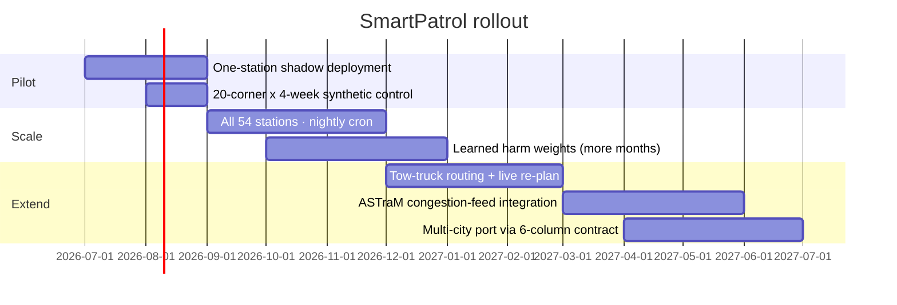
```mermaid
gantt
    title SmartPatrol rollout
    dateFormat YYYY-MM
    section Pilot
    One-station shadow deployment        :2026-07, 2M
    20-corner x 4-week synthetic control :2026-08, 1M
    section Scale
    All 54 stations · nightly cron       :2026-09, 3M
    Learned harm weights (more months)   :2026-10, 3M
    section Extend
    Tow-truck routing + live re-plan     :2026-12, 3M
    ASTraM congestion-feed integration   :2027-03, 3M
    Multi-city port via 6-column contract:2027-04, 3M
```

- [ ] One-station shadow deployment; falsifiable 20-corner × 4-week synthetic-control pilot
- [ ] All 54 stations on a nightly cron
- [ ] Learn the harm weights from more months of data (today they are expert-set)
- [ ] Mobile constable app; per-beat tow-truck routing + live re-plan
- [ ] Live ASTraM congestion-feed integration
- [ ] Multi-city port - any city with the 6-column data contract maps in

---

## Team &amp; credits

Built for **Gridlock Hackathon 2.0** - Flipkart × Bengaluru Traffic Police / ASTraM × MapMyIndia.

- **Data** - the Bengaluru Traffic Police, for the official 298,450-row parking-violation export that makes every number here real.
- **Maps & routing** - MapMyIndia / **Mappls** Web Maps SDK v3.
- **Host** - Gridlock Hackathon 2.0 (Flipkart) for the brief and the room.

**Links:** [Live app](https://smartpatrol-danish-3909s-projects.vercel.app/app) · [Pitch deck](https://drive.google.com/file/d/1sax6wWW9ilxucKK9mQok5GjUtAVmEsIS/view?usp=sharing) · [Demo video](https://youtu.be/ATXbWvJ3E9U) · [Repo](https://github.com/agdanish/smartpatrol-gridlock)

---

## License

Released under the **MIT License** (SPDX: `MIT`).

<div align="center">
<sub>SmartPatrol - it scores places, not people. Built on one official dataset. Powered by Mappls.</sub>
<br/>
<a href="#smartpatrol">↑ back to top</a>
</div>
